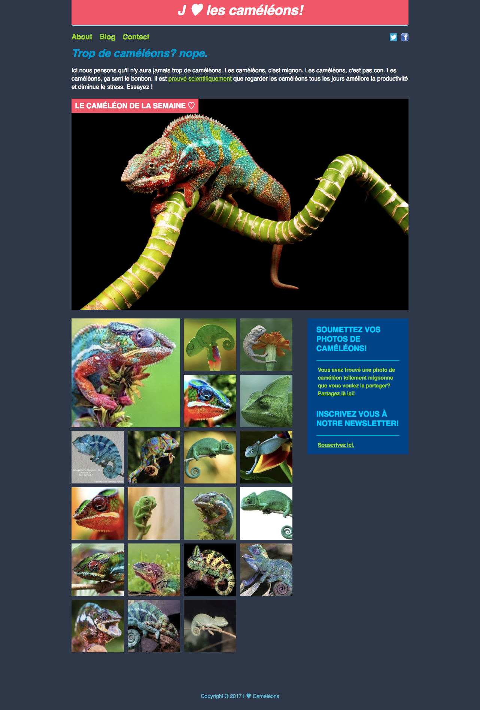

## Instructions

Le repo de base contient uniquement les images : c'est à vous de créer l'arborescence de fichiers et dossiers ! 🤓

Pour les petites coeurs, vous pouvez utiliser les caractères spéciaux représentant un coeur. Le site https://unicode-table.com/fr/ est top pour trouver les caractères spéciaux qu'on souhaite utiliser. Il donne même le code HTML.

## Charte

* Largeur de la page (sans les marges) : `900px`
* Police : `Open Sans`, à aller chercher sur Google Fonts
* les codes couleur dont vous pourriez avoir besoin :
  + rose saumon = `#f05768`
  + bleu/gris foncé = `#2f3848`
  + bleu soutenu = `#004488`
  + bleu clair (titres) = `#00ccff`
  + vert = `yellowgreen`

## Bonus

Ajoutons un « favicon » ! Le favicon, c'est une petite image qui s'affichera dans l'onglet du navigateur. Dans le dossier `images/`, vous trouverez un fichier `favicon.ico`.

Comme la plupart des méta-informations, c'est dans le `<head>` que ça se passe ! Plus d'infos [par ici](https://developer.mozilla.org/fr/Apprendre/HTML/Introduction_%C3%A0_HTML/The_head_metadata_in_HTML#Adding_custom_icons_to_your_site) !
